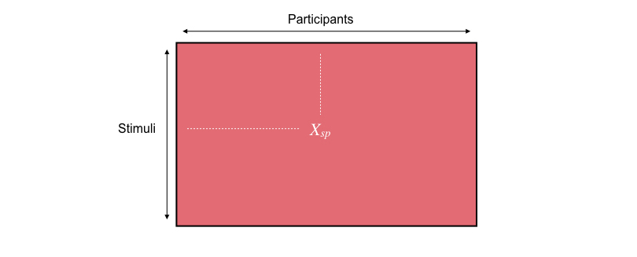
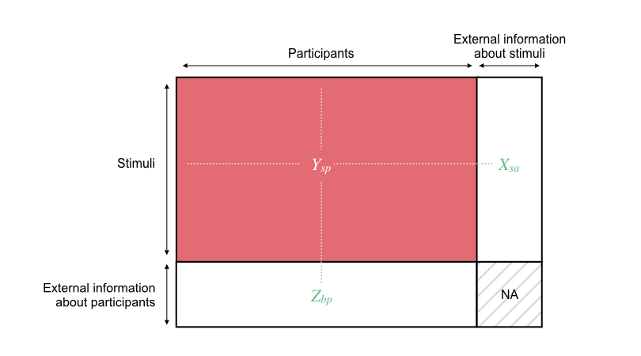

# Introduction

TESTdv Analyzing consumers’ perception of complex concepts through a set of stimuli (e.g. a set of products, a set of advertising videos) is becoming of the main interest in the marketing field. To meet this increasing expectation, a new methodology has been developed in consumer research with the aim of studying how consumers perceive a given complex concept through a set of stimuli (see Brard & Lê (2017)). In practice, each participant of the panel is asked to sort the stimuli into two predefined categories: stimuli assessed as non-representative of the concept and stimuli assessed as representative of the concept. Such an experimental protocol presents strong similarities with the Q-sort, which refers to one of the steps in the Q-methodology used in psychology to study human subjectivity and which consists in asking participants to sort some statements into ordinal predefined categories corresponding to a continuum of agreement (see Stephenson, 1953). With the aim of distinguishing these two procedures according to the rating scale used during the protocol, the present methodology used in consumer research is referred to as *binary Q-method*.

In this vignette, we present the `BinQmet` package, a package that provides a statistical procedure to analyse data obtained during binary Q-method experiment. The present statistical procedure involves a stimulus-oriented statistical analysis and a participant-oriented analysis that are exposed hereafter. 

The package presents the ability to manage covariates providing pieces of information about the stimuli assessed during the experiment and/or about the participants. These covariates can be used to facilitate the interpretation of the similarities and differences between the stimuli during the stimulus-oriented analysis and/or between the participants during the participant-oriented analysis. The package also provides several `ggplot2`-type graphical tools to facilitate the interpretation of the results and `plotly`-type tuning parameters to make them interactive.

Section 2 presents the installation of the package from GitHub repository. Section 3 presents the kinds of data that can be handle with the package. Section 4 exposes the practical use of the package to analyse binary Q-method data. Sections 5 and 6 respectively focus on the stimulus- and participant-oriented statistical approaches. An artificial small pedagogic data set is introduced as a motivating examples in this vignette, and a real data set is briefly presented.

# Installing the package

The package is freely available for download online at https://github.com/MargotBr/BinQmet. The user can get the current development version from GitHub in the following way:

```{r eval = FALSE}
install.packages("devtools") # only if the package has not been installed yet
devtools::install_github("MargotBr/BinQmet", build_vignettes = TRUE)
library(BinQmet)
```

```{r eval = FALSE}
library(BinQmet)
```

# Using the proper format of data

The package is able to manage matrices of dimensions $S \times P$, where $S$ denotes the number of stimuli rated during the experiment and $P$ denotes the number of participants who were involved in the experiment. At the intersection of the line $s$ and the column $p$ is the rating of the $s$-th stimulus by the $p$-th participant $Y_{sp}$. $Y_{sp}$ equals 1 if the $s$-th stimulus has been assessed as representative of the concept by the $p$-th participant, and equals 0 otherwise.



If external information about the stimuli and/or the participants was collected during the experiment, the previous data set is supplemented by these covariates. More precisely, covariates providing information about the stimuli are added to the previous data set as supplementary columns; and covariates providing information about the participants are added to the previous data set as supplementary lines. The intersection cells between these covariates are filled by missing data.



# Implementing the procedure

The `analyse.BinQmet` function implements the stimulus- and the participant-oriented statistical analysis presented previously. The help page of the functions can be accessed with this code:

```{r}
help(analyse.BinQmet)
```

To illustrate the outputs and graphs of the function, let's use a small pedagogic data set named *pedagdata*. This data set refers to the ratings of the representativeness of a given concept provided to 8 stimuli by a panel of 20 participants. In this data set, '1' stands for a 'representative of the concept' assessment, and '0' stands for a 'not representative of the concept' assessment. These binary Q-method data are supplemented by covariates providing information about the stimuli and the raters. The columns 21, 22, 23, 24, and 25 provide information about the stimuli: *Citrus fruits intensity* (continuous), *Vanilla intensity* (continuous), *Wood intensity* (continuous), *Lotus intensity* (continuous), and *Packaging* which is either the current one or a prototype (categorical). The lines 9, 10, 11 provide information about the raters: *Gender* (categorical), *Age bracket* (categorical), *Frequency of use* (categorical). The code to import and visualize this data set is:

```{r eval = FALSE}
data(pedagdata)
pedagdata
```

The `analyse.BinQmet` function uses by default the following other important arguments:

- `dta`, specifying the name of the data set to be used;
- `id.info.stim = NULL`, `type.info.stim = NULL`, `id.info.part = NULL`, and `type.info.part = NULL`, meaning that no covariates about either the stimuli nor the participants are available in the data set. 

As the data set contains covariates about the stimuli and the participants, the last arguments have to be modified in the following way:

- `id.info.rater = c(21, 22, 23, 24, 25)`, meaning that the 5 covariates about the stimuli are accessible in columns 21, 22, 23, 24, and 25 of the data set;
- `type.info.stim = c(rep("cont", 4), "cat")`, meaning that the 4 first covariates about the stimuli are continuous and that the last one is categorical;
- `id.info.part = c(9, 10, 11)`, meaning that the 3 covariates about the participants are accessible in lines 9, 10, and 11 of the data set;
- `type.info.part = rep("cat", 3)`, meaning that the 3 covariates about the participants are categorical.

Finally, the code to implement the procedure is:

```{r eval = FALSE}
res.pedag <- analyse.BinQmet(pedagdata, id.info.stim = 21 : ncol(pedagdata), type.info.stim = c(rep("cont", 4), "cat"), id.info.part = 9 : nrow(pedagdata), type.info.part = rep("cat", 3))
```

```{r echo = FALSE, echo = FALSE, message = FALSE}
res.pedag <- analyse.BinQmet(pedagdata, id.info.stim = 21 : ncol(pedagdata), type.info.stim = c(rep("cont", 4), "cat"), id.info.part = 9 : nrow(pedagdata), type.info.part = c(rep("cat", 2), "cont"), graph = FALSE)
res.pedag
```

# Analysing the data through a stimulus-oriented perspective

The objective of the stimulus-oriented analysis is to study how stimuli have been associated with the complex concept by the participants. Indeed, one main objective of the consumer researcher is to study the similarities and differences observed among the stimuli according to their representativeness of the concept. In practice, this is done by applying a Multiple Factor Analysis (MFA) to a multiple table highlighting the specificities of binary Q-method data (see Brard & L\^{e} (2017)). On the obtained representation of the stimuli, two stimuli are close (resp. distant) if they have been perceived as similarly representative (resp. differently representative) of the concept by the panel of participants. This representation is supplemented by colored areas that help the user to easily and quickly detect the way stimuli have been associated with the given concept.

The first object returned by the function is the multiple table used during the stimulus-oriented statistical procedure. This multiple table is the combination of a table of dimensions $S \times R$ containing categorical data (i.e. the raw binary ratings), and a table of dimensions $S \times 2$ containing count data (i.e. the degree of association of each stimulus to the two predefined categories). The importance of analysing this multiple table rather than the raw binary ratings is described in Brard & Lê (2017). This object can be accessed with this code:

```{r}
res.pedag$BinQmet.data
```

As mentioned previously, this multiple table is then submitted to a Multiple Factor Analysis (MFA). All the results of this factorial analysis are saved in the `res.pedag$res.mfa` object, which contains several elements:

```{r}
names(res.pedag$res.mfa)
```

The first graph created by the function is the first MFA factorial plane. On this factorial plane, two stimuli are close (resp. distant) if they represent the concept in the same way (resp. in a different way). With the aim of helping the user to easily detect the areas associated with a high degree of representativeness of the concept and the areas associated with a low degree of representativeness of the concept, a response surface is projected on this factorial plane. The computation of this response surface is described in Brard & Lê (2017). In the present pedagogic example, the panel of participants highlighted two groups of stimuli: stimuli *Stim1*, *Stim2*, *Stim3*, and *Stim4* (rather not representative of the concept) on the one hand; and stimuli *Stim5*, *Stim6*, *Stim7*, and *Stim8* (rather representative of the concept) on the other hand.

```{r echo = FALSE, fig.width = 14, message = FALSE, results = FALSE}
plot.BinQmet(res.pedag, choice = "stim", col.pos.ratings = "#F36170")
```

The areas can be colored according to new colors in this plot. To do so, the following code using the `plot.BinQmet` function is used:

```{r echo = FALSE, fig.width = 14, message = FALSE, results = FALSE}
plot.BinQmet(res.pedag, choice = "stim", col.pos.ratings = "orange")
```

We can draw a bar plot with the eigenvalues of MFA with the following code:

<center>
```{r fig.width=6, fig.height=3, dpi=400}
barplot(res.pedag$res.mfa$eig[, 1], main = "Eigenvalues", names.arg = paste0("Dim", 1 : nrow(res.pedag$res.mfa$eig)))
```
</center>

This graph allows to detect the number of dimensions interesting for the interpretation of the multidimensional representation of the set of stimuli. The user can then plot the graph for the other interesting dimensions, let's say the third and the fourth dimensions (even if in our case, they should not be interpreted):

```{r eval = FALSE}
plot.BinQmet(res.pedag, choice = "stim", axis = c(3, 4))
```

```{r echo = FALSE, fig.width = 14, message = FALSE, results = FALSE}
plot.BinQmet(res.pedag, choice = "stim", axis = c(3, 4), col.pos.ratings = "#F36170")
```

The `plot.BinQmet` allows to plot the multidimensional representation of the set of stimuli in an interactive way. By moving the cursor on a point, several pieces of information are printed:

```{r eval=FALSE}
plot.BinQmet(res.pedag, choice = "stim", interact = TRUE)
```

<center>
```{r echo = FALSE, fig.width = 10.5, fig.height = 4.5, message = FALSE, warning = FALSE}
plot.BinQmet(res.pedag, choice = "stim", interact = TRUE, col.pos.ratings = "#F36170", vignette = TRUE)
```
</center>

# Analysing the data through a participant-oriented perspective

The objective of the participant-oriented analysis is to study how participants have been perceived the complex concept through the set of stimuli. Indeed, the complexity of a concept refers to its multidimensionality, the subjective rating of this concept being based on various criteria for which the relative importance is specific to each participant In many situations, this complexity can result in disagreements between participants, which highlights a diversity of perceptions of the complex concept through the set of stimuli. One main objective of the consumer researcher is to analyse this diversity of perceptions by pointing out segments of participants who share the same opinion on the complex concept. More precisely, the objective is to determine if the participants have perceived the complex concept through the set of stimuli in a consensual way; and, if it is not the case, to determine if homogeneous clusters of participants can be identified. In practice, this is done through a logistic regression modeling framework extended to the agreement-based clustering of the binary ratings provided by the participants (see Brard et al. (2017)). This model-based procedure is implemented in the `AgreeClustBin` function of the `AgreeClust` package:

```{r eval = FALSE}
help(AgreeClust)
vignette("AgreeClust")
help(AgreeClustBin)
```

All the results of the segmentation of the participants by using the `AgreeClustBin` function are saved in the `res.pedag$res.AgreeClust` object:

```{r}
res.pedag$res.AgreeClust
```

The first graph of the participant-oriented approach shows the clustering process of the participants. The dendrogram representing the structure of disagreement is presented at the top of the graph. In the present example, the $p-$values associated to the different levels of its hierarchy show that two clusters of participants exist among the panel, as the $3-$ latent class model is not significant w.r.t the $2-$ latent class model. The consolidation step, whose the result is presented at the bottom of the graph, did not modify the partition of participants. Finally, we can say that this panel is composed of two disagreed clusters: the first fifteen participants (cluster 1) against the last five participants (cluster 2).

```{r echo = FALSE, fig.width=8, dpi=400, fig.height=8, message = FALSE, results = FALSE}
plot.BinQmet(res.pedag, choice = "part.seg", col.clust = c("#42B983", "#F36170"))
```

The clusters of participants can be colored according to new colors in this plot. To do so, the following code is used:

```{r fig.width=8, dpi=400, fig.height=8, message=FALSE, results=FALSE}
plot.BinQmet(res.pedag, choice = "part.seg", col.clust.part = c("green", "orange"))
```

The second graph of the participant-oriented approach shows the multidimensional representation of the structure of disagreement observed among the panel. This representation is obtained by submitting the $20 \times 8$ matrix contained in the object *res.pedag$res.AgreeClust$profiles.residuals* to a Principal Components Analysis (PCA). PCA provides two main representations: a representation of the individuals (i.e. a representation of the 20 participants) and a representation of the variables (i.e. a representation of the 8 stimuli). On the representation of the participants, two participants are distant if they present a high disagreement. As these two representations are related to each other, the representation of the participants has to be interpreted regarding to the representation of the stimuli. This may be expressed as follows: participants are on the same side as the stimuli they assessed as representative of the concept, and opposite of the stimuli they assessed as not representative of the concept. 

In the present example, cluster 1 is characterized by 'representative' ratings for stimuli *Stim5*, *Stim6*, *Stim7*, and *Stim8*; and by 'not representative' ratings for stimuli *Stim1*, *Stim2*, *Stim3*, and *Stim4*. On the contrary, cluster 2 is characterized by 'not representative' ratings for stimuli *Stim5*, *Stim6*, *Stim7*, and *Stim8*; and by 'representative' ratings for stimuli *Stim1*, *Stim2*, *Stim3*, and *Stim4*. The aim of this plot is to help the user to easily detect the main axis of disagreement observed among the panel of participants.

```{r echo=FALSE, fig.width=8, dpi=400, fig.height=5, message=FALSE, results=FALSE}
plot.BinQmet(res.pedag, choice = "part.mul", col.clust = c("#42B983", "#F36170"))
```

The `plot.BinQmet` allows to plot this multidimensional representation of the structure of disagreement in an interactive way. By moving the cursor on a point, several pieces of information are printed:

```{r eval = FALSE}
plot.BinQmet(res.pedag, choice = "part.mul", interact = TRUE)
```

```{r echo = FALSE, message = FALSE, warning = FALSE, fig.width=10, fig.height=6}
plot.BinQmet(res.pedag, choice = "part.mul", interact = TRUE, col.clust = c("#42B983", "#F36170"), vignette = TRUE)
```

Finally, the participant-oriented approach provides an automatic description of the clusters of participants. This description can be accessed with this code: 

```{r results = FALSE}
res.pedag$res.AgreeClust$charact.clust
```

For instance, as shown on the following output, cluster 1 is composed of 15 raters (75/% of the panel) and the most representative participant of this cluster is *Subj3*. In this cluster, and relatively to the average, women and participants who often use the product are overrepresented; while men are underrepresented. Relatively to the average, participants of this cluster present a higher propensity to give a 'representative of the concept' assessment to stimuli presenting a high intensity of citrus fruits flavor and to stimuli with the prototype packaging; while they present a lower propensity to give a 'representative of the concept' assessment to stimuli presenting a high intensity of wood flavor and to stimuli with the current packaging:

```{r echo = FALSE}
res.pedag$res.AgreeClust$charact.clust[[1]]
```

A real binary Q-method data set is also available in the help page of the package. This data set corresponds to data obtained during an experiment where 39 perfumes have been evaluated by 120 consumers according to their representativeness of the complex concept of innovation. However, as the computation of the tests for the significance of the levels of the dendrogram can be time-consuming, its analysis is not presented in this vignette. This analysis can be accessed with this code:

```{r eval = FALSE}
data(perfumes)
res.perfumes <- analyse.BinQmet(perfumes, id.info.stim = 121 : ncol(perfumes), type.info.stim = rep("cont", 27), id.info.part = 40 : nrow(perfumes), type.info.part = rep("cat", 2))
res.perfumes
plot.BinQmet(res.perfumes, interact = TRUE)
```


# References

Brard, M., & Lê, S. (2017) Adaptation of the Q-methodology for the characterization of a complex concept through a set of products: From the collection of the data to their analysis. Food Quality and Preference, in press.

Brard, M., Lê, S., & Causeur, D. (2017) Modeling agreement for the clustering of multivariate binary profiles. Journées de Statistique 2017.

Stephenson, W. (1953). The study of behavior: Q-technique and its methodology. University of Chicago Press, Chicago.
